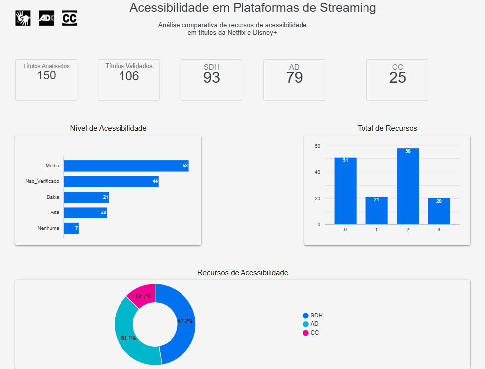
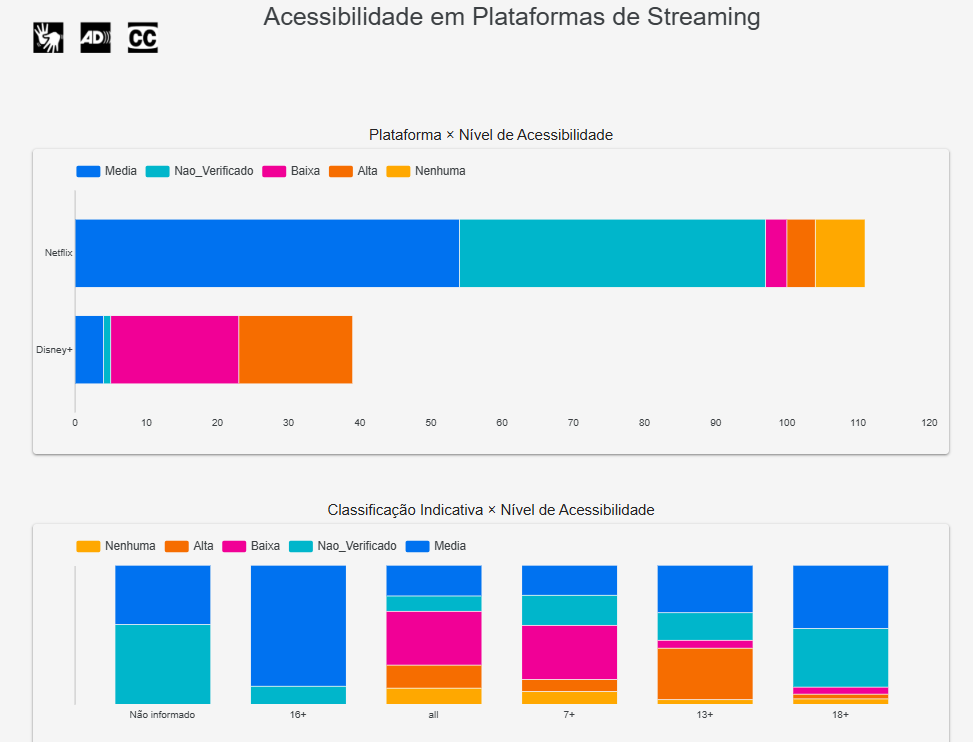
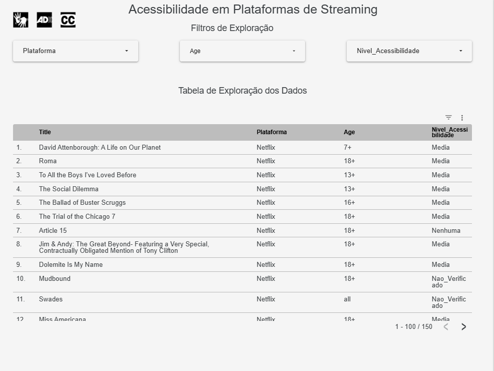
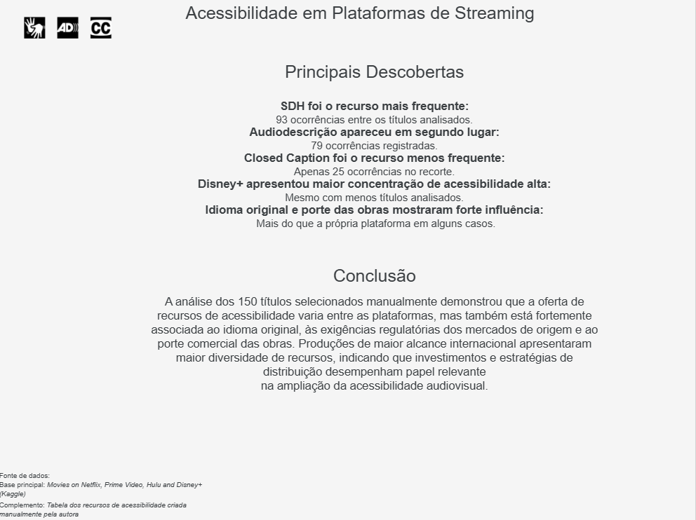

# 🎬 Acessibilidade no Streaming

## Uma análise sobre Closed Caption, SDH, Audiodescrição e Legendas Simples

> Projeto desenvolvido com Python, PySpark e Looker Studio para analisar a disponibilidade de recursos de acessibilidade em títulos da Netflix e Disney+.



---

# 📖 Sobre o projeto

A acessibilidade desempenha um papel fundamental na democratização do acesso ao entretenimento, permitindo que diferentes públicos possam consumir conteúdos audiovisuais de forma mais inclusiva. Recursos como **Closed Caption (CC)**, **Subtitles for the Deaf and Hard of Hearing (SDH)**, **Audiodescrição (AD)** e **legendas simples** contribuem para ampliar a experiência de milhões de usuários, mas sua disponibilidade ainda é pouco explorada sob a perspectiva da análise de dados.

Este projeto nasceu da união entre minha experiência profissional no setor audiovisual, especialmente na área de acessibilidade para cinema, televisão e plataformas de streaming, e os conhecimentos adquiridos ao longo da minha formação em Análise de Dados.

Utilizando Python, PySpark e técnicas de análise exploratória, foram integrados dados públicos sobre títulos disponíveis na Netflix e no Disney+, além de uma coleta manual das informações relacionadas aos recursos de acessibilidade presentes nessas plataformas.

O objetivo foi investigar como esses recursos estão distribuídos entre os títulos analisados, identificar padrões entre as plataformas e demonstrar como a análise de dados pode contribuir para discussões sobre inclusão e acessibilidade no entretenimento digital.

---

# 🎯 Problema analisado

Embora plataformas de streaming disponibilizem diferentes recursos de acessibilidade, ainda existe pouca informação sobre como esses recursos estão distribuídos entre seus catálogos.

Este projeto busca responder, por meio da análise de dados, como Netflix e Disney+ disponibilizam recursos como Closed Caption, SDH, Audiodescrição e legendas simples em português, permitindo identificar padrões, diferenças entre as plataformas e oportunidades de ampliação da acessibilidade.

---

# 📌 Objetivos

* Comparar a disponibilidade de recursos de acessibilidade entre Netflix e Disney+.
* Analisar a presença de Closed Caption (CC), SDH, Audiodescrição (AD) e legendas simples em português.
* Explorar características dos títulos, como ano de lançamento, classificação indicativa e avaliação no Rotten Tomatoes.
* Desenvolver um dashboard interativo para facilitar a visualização dos resultados.
* Demonstrar a aplicação de técnicas de ETL, análise exploratória e visualização de dados em um contexto real.

---

# 🔄 Metodologia

O desenvolvimento do projeto seguiu as seguintes etapas:

1. Coleta do dataset público contendo informações sobre títulos disponíveis nas plataformas de streaming.
2. Coleta manual das informações de acessibilidade diretamente na Netflix e no Disney+.
3. Limpeza, padronização e tratamento dos dados utilizando PySpark.
4. Integração das tabelas e criação da base analítica.
5. Realização da Análise Exploratória de Dados (EDA).
6. Construção do dashboard interativo no Looker Studio.
7. Interpretação dos resultados e elaboração dos principais insights.

---

# 🗂️ Base de dados

O projeto utilizou duas fontes principais de dados.

### Dataset público

Base disponibilizada no Kaggle contendo informações sobre filmes e séries, incluindo:

* Título
* Ano de lançamento
* Classificação indicativa
* Avaliação no Rotten Tomatoes
* Plataforma de disponibilidade

### Dados de acessibilidade

Foi realizada uma coleta manual diretamente nas plataformas Netflix e Disney+ para registrar a disponibilidade dos seguintes recursos:

* Closed Caption (CC)
* Subtitles for the Deaf and Hard of Hearing (SDH)
* Audiodescrição (AD)
* Legendas simples em português
* Idiomas disponíveis para cada recurso

---

# 🛠️ Tecnologias utilizadas

* Python
* PySpark
* Pandas
* Google Colab
* Looker Studio
* Git
* GitHub

---

# 🧹 Tratamento dos dados

Durante a preparação dos dados foram realizadas as seguintes etapas:

* Remoção de colunas desnecessárias;
* Tratamento de valores ausentes;
* Padronização dos tipos de dados;
* Criação de colunas derivadas;
* Integração das tabelas;
* Organização da base analítica;
* Preparação dos dados para visualização no Looker Studio.

---

# 📈 Perguntas respondidas

Durante a análise buscou-se responder às seguintes questões:

* Qual plataforma apresenta maior disponibilidade de recursos de acessibilidade?
* Quais recursos aparecem com maior frequência?
* As legendas simples em português são mais comuns que os recursos específicos de acessibilidade?
* Existe relação entre a avaliação dos títulos e a presença desses recursos?
* Como os recursos de acessibilidade estão distribuídos entre Netflix e Disney+?

---

# 📊 Resultados

A análise exploratória permitiu identificar padrões importantes relacionados à oferta de recursos de acessibilidade nas plataformas avaliadas.




Exemplos de visualizações:

* Distribuição dos títulos por plataforma;
* Distribuição por ano de lançamento;
* Classificação indicativa;
* Distribuição das notas do Rotten Tomatoes;
* Comparação entre os recursos de acessibilidade;
* Comparação entre Netflix e Disney+.

---

# 📊 Dashboard

O projeto inclui um dashboard desenvolvido no Looker Studio, permitindo explorar os dados de forma interativa.

**🔗 Dashboard:** https://datastudio.google.com/reporting/19bd09e1-e599-43b6-9527-e60f18ab9a18




---

# 💡 Conclusões

A análise evidenciou diferenças na disponibilidade dos recursos de acessibilidade entre as plataformas estudadas, mostrando que alguns recursos são significativamente mais frequentes do que outros.

Também foi possível observar que as legendas simples em português apresentam maior disponibilidade do que recursos específicos voltados à acessibilidade, como Closed Caption e SDH, reforçando a importância de ampliar a oferta desses recursos para promover uma experiência mais inclusiva aos usuários.

Além de responder às perguntas propostas, o projeto demonstra como a análise de dados pode apoiar discussões sobre acessibilidade e inclusão no entretenimento digital.

---

# 📚 Aprendizados

Durante o desenvolvimento deste projeto foi possível aplicar e consolidar conhecimentos relacionados a:

* ETL e preparação de dados;
* Limpeza e transformação de dados com PySpark;
* Integração de múltiplas fontes de dados;
* Análise Exploratória de Dados (EDA);
* Desenvolvimento de dashboards no Looker Studio;
* Comunicação de resultados por meio de visualizações e documentação técnica.

---

# 📁 Estrutura do projeto

```text
analise-acessibilidade-streaming/
│
├── data/
│   ├── raw/
│   └── processed/
│
├── notebooks/
│
├── dashboard/
│
├── docs/
│
├── images/
│
├── README.md
├── requirements.txt
└── LICENSE
```

---

# 👩‍💻 Sobre a autora

**Mara Alonso**

Profissional do setor audiovisual com experiência em acessibilidade para cinema, televisão e plataformas de streaming, aliando conhecimentos em análise de dados para desenvolver soluções baseadas em dados e apoiar discussões sobre inclusão no entretenimento digital.

* GitHub: https://github.com/alonsomara
* LinkedIn: https://www.linkedin.com/in/alonsomara/
